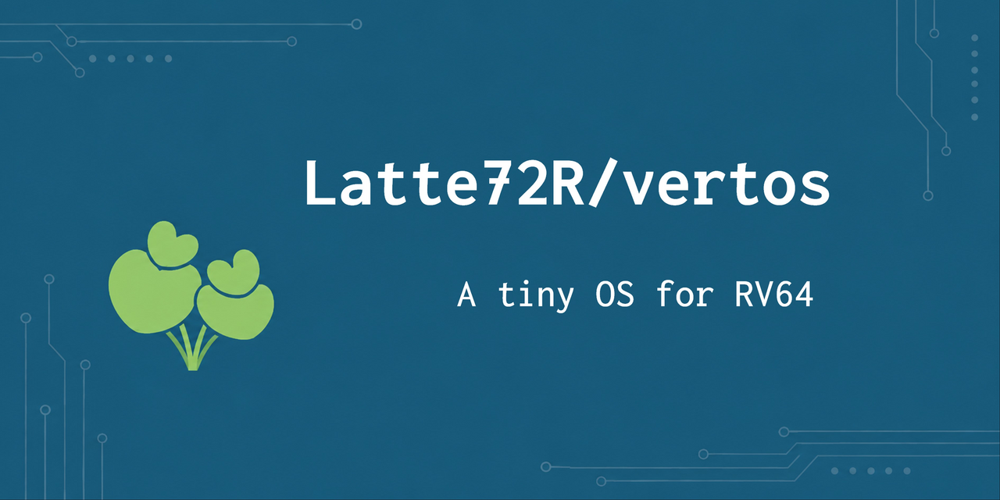

# vertos



Rustで実装された，RV64IMAC 向けのシンプルなOSです．

現在は，OpenSBIを介したコンソール出力，例外処理，Bump Allocatorによる動的メモリ確保を実装しています．

## 必要なツール

- [Rust](https://www.rust-lang.org/tools/install)
- [QEMU](https://www.qemu.org/)（`qemu-system-riscv64`）

## 使い方

カーネルのビルドとQEMUでの実行には，それぞれ次のコマンドを使用します．

```sh
make build  # カーネルをビルド
make run    # ビルドしたカーネルをQEMUで実行
```

そのほか，ソースコードの整形や検査もMakefileから実行できます．

```sh
make fmt    # Rustソースを整形
make check  # カーネルをビルドせずに検査
make test   # QEMUでカーネルのテストを実行
make clean  # ビルド生成物を削除
```

QEMUを終了するには，`Ctrl-a`を押してから`x`を押します．

## ディレクトリ構成

```text
boot/       起動処理と例外エントリのアセンブリ
linker/     カーネル用リンカスクリプト
scripts/    QEMU起動スクリプト
src/        Rustで実装したカーネル本体
```

## ライセンス

このプロジェクトは[MIT License](./LICENSE)のもとで公開されています．
